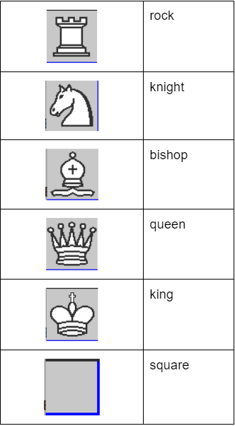
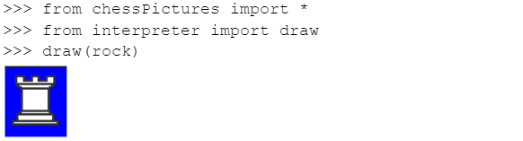
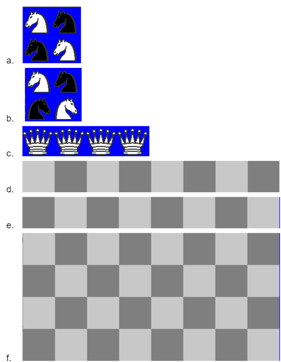
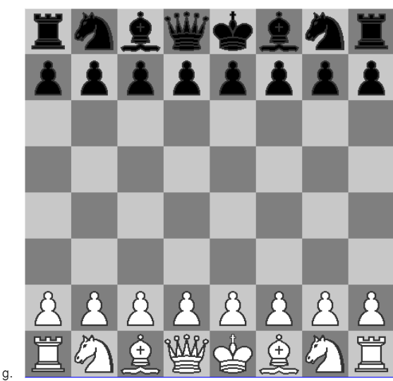

# Ejercicios Propuestos:

En esta tarea, individualmente usted pondrá en práctica sus conocimientos de programación en Python para dibujar un tablero de Ajedrez. La parte gráfica ya está programada, usted sólo tendrá que concentrarse en las estructuras de datos subyacentes.
Con el código proporcionado usted dispondrá de varios objetos de tipo Picture para poder realizar su tarea:

  

Estos objetos estarán disponibles importando la biblioteca: chessPictures y estarán internamente representados con arreglos de strings que podrá revisar en el archivo pieces.py

La clase Picture tiene un sólo atributo: el arreglo de strings img, el cual contendrá la representación en caracteres de la figura que se desea dibujar. 
La clase Picture ya cuenta con una función implementada, no debe modificarla, pero si puede usarla para implementar sus otras funciones:

  * invColor: recibe un color como un carácter de texto y devuelve su color negativo, también como texto, deberá revisar el archivo colors.py para conocer los valores negativos de cada carácter.
La clase Picture contará además con varios métodos que usted deberá implementar:

  1. verticalMirror: Devuelve el espejo vertical de la imagen.
  2. horizontalMirror: Devuelve el espejo horizontal de la imagen.
  3. negative: Devuelve un negativo de la imagen.
  4. join: Devuelve una nueva figura poniendo la figura del argumento al lado derecho de la figura actual.
  5. up: Devuelve una nueva figura poniendo la figura recibida como argumento, encima de la figura actual.
  6. under: Devuelve una nueva figura poniendo la figura recibida como argumento, sobre la figura actual.
  7. horizontalRepeat, Devuelve una nueva figura repitiendo la figura actual al costado la cantidad de veces que indique el valor de n.
  8. verticalRepeat Devuelve una nueva figura repitiendo la figura actual debajo, la cantidad de veces que indique el valor de n.
  
Tenga en cuenta que para implementar todos estos métodos, sólo deberá trabajar sobre la representación interna de un Picture, es decir su atributo img.

Para dibujar una objeto Picture bastará importar el método draw de la biblioteca interpreter y usarlo de la siguiente manera:

  

# Ejercicios:

Para resolver los siguientes ejercicios sólo está permitido usar ciclos, condicionales, definición de listas por comprensión, sublistas, map, join, (+), lambda, zip, append, pop, range.

  1. Implemente los métodos de la clase Picture. Se recomienda que implemente la clase picture por etapas, probando realizar los dibujos que se muestran en la siguiente preguntas.
  2. Usando únicamente los métodos de los objetos de la clase Picture dibuje las siguientes figuras (invoque a draw):

  

  

 